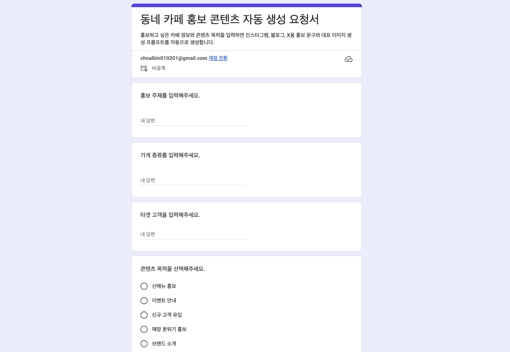
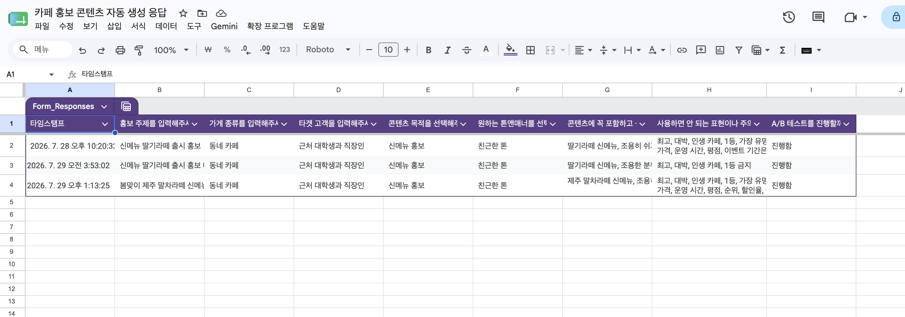
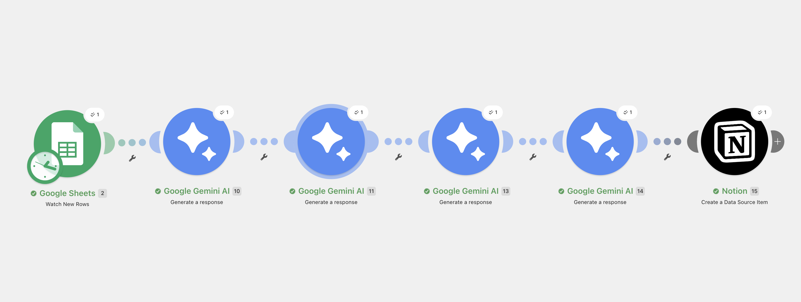
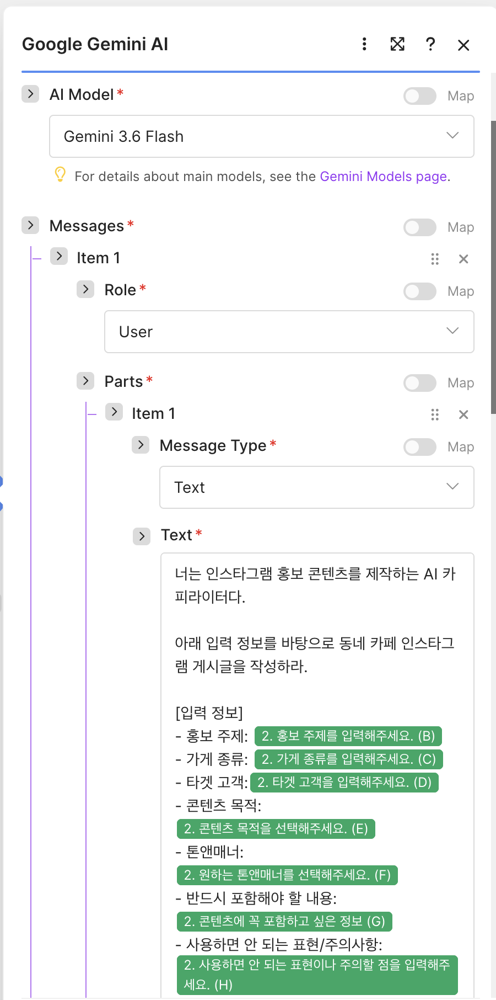
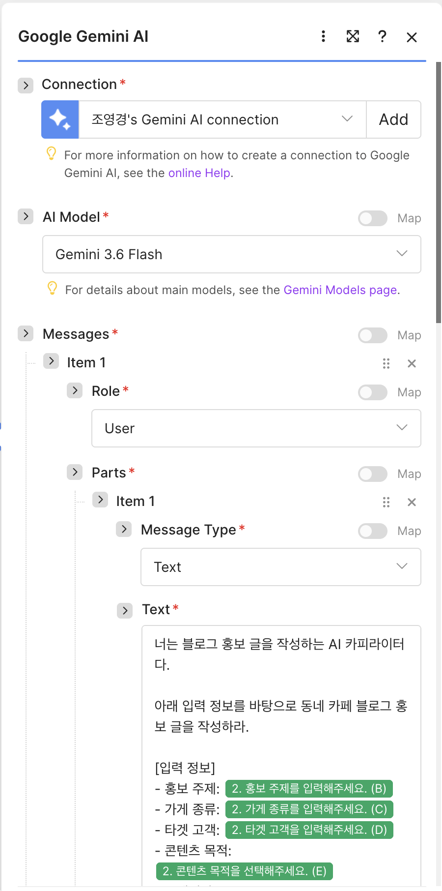
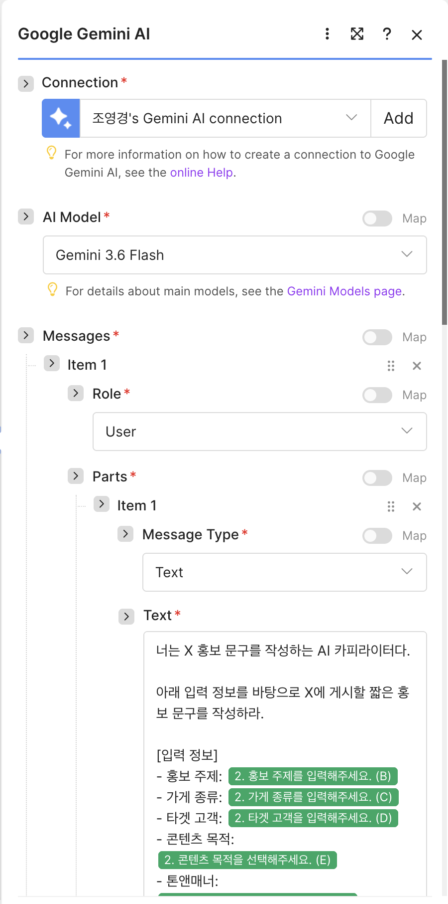
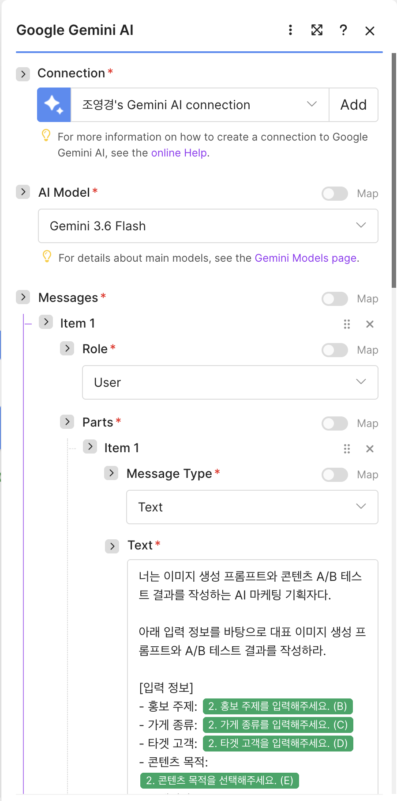
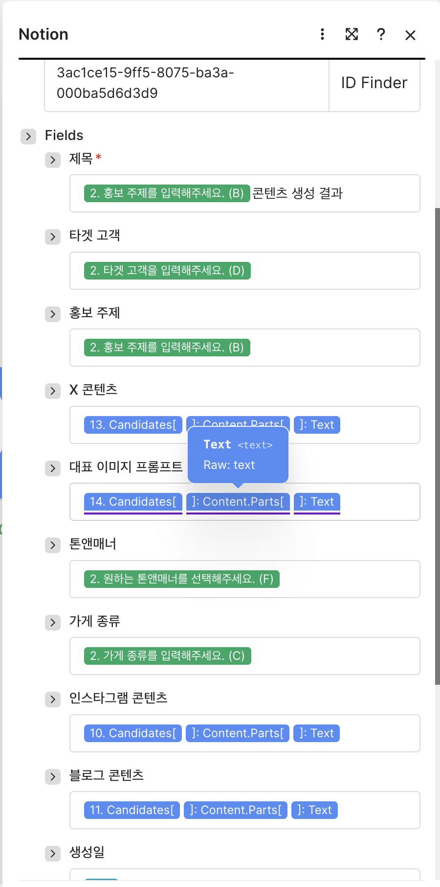
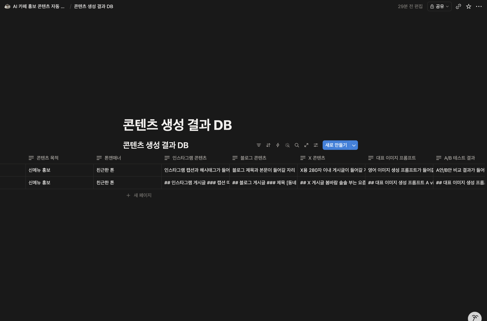
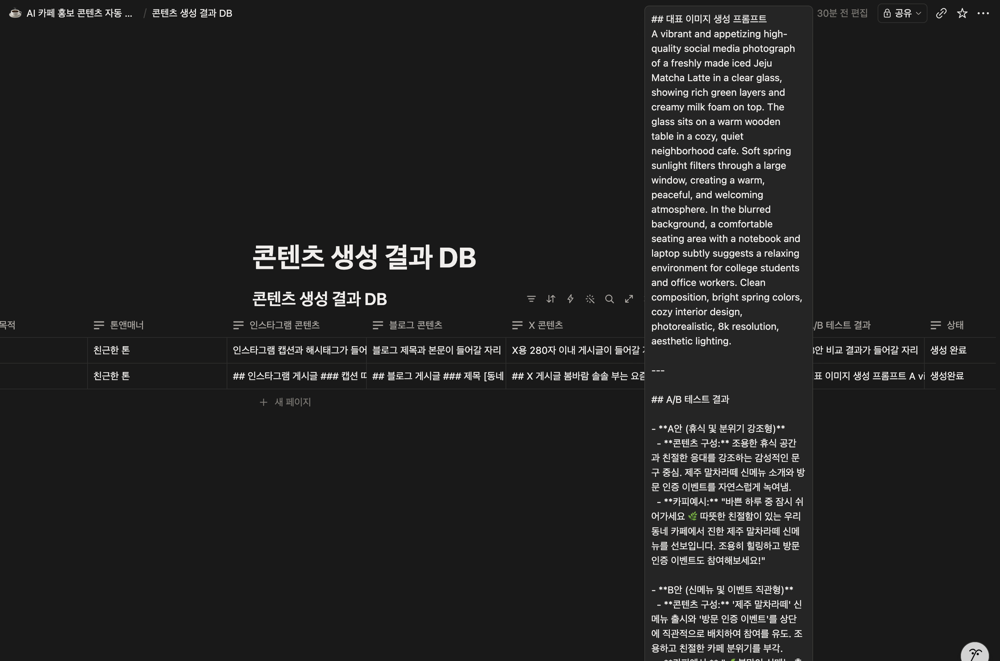

# 동네 카페를 위한 AI 멀티채널 홍보 콘텐츠 자동 생성 시스템

## 1. 프로젝트 개요

본 프로젝트는 동네 카페가 하나의 홍보 주제를 입력하면, AI가 인스타그램, 블로그, X용 홍보 콘텐츠를 자동으로 생성하고 Notion 데이터베이스에 저장하는 자동화 시스템이다.

Google Form을 통해 홍보 주제, 가게 종류, 타겟 고객, 콘텐츠 목적, 톤앤매너, 필수 포함 내용, 금지 표현, A/B 테스트 여부를 입력받는다. 입력된 값은 Google Sheets에 저장되고, Make 자동화 시나리오를 통해 Gemini AI에 전달된다.

Gemini는 플랫폼별 특성에 맞춰 인스타그램 콘텐츠, 블로그 콘텐츠, X 콘텐츠, 대표 이미지 생성 프롬프트, A/B 테스트 결과를 생성한다. 최종 결과는 Notion 데이터베이스에 플랫폼별 컬럼으로 구분되어 저장된다.

---

## 2. 프로젝트 목표

본 프로젝트의 목표는 다음과 같다.

1. 하나의 입력값을 기반으로 여러 플랫폼에 맞는 홍보 콘텐츠를 자동 생성한다.
2. 인스타그램, 블로그, X의 플랫폼별 특성에 맞는 문체와 형식을 적용한다.
3. 이미지 생성 AI에 활용할 수 있는 대표 이미지 프롬프트를 생성한다.
4. A/B 테스트 결과를 통해 서로 다른 홍보 톤의 활용 가능성을 비교한다.
5. 생성된 결과물을 Notion에 저장하여 팀원이 쉽게 확인하고 검수할 수 있도록 한다.

---

## 3. 사용 도구

| 도구 | 역할 |
|---|---|
| Google Form | 홍보 콘텐츠 생성에 필요한 입력값 수집 |
| Google Sheets | Google Form 응답 저장 |
| Make | 전체 자동화 워크플로우 연결 |
| Gemini | 플랫폼별 홍보 콘텐츠 생성 |
| Notion | 생성 결과 저장 및 팀 프로젝트 정리 |
| 이미지 생성 AI | 대표 이미지 생성 |
| GitHub | 최종 보고서, 프롬프트, 결과물 정리 |

---

## 4. 전체 자동화 워크플로우

```text
Google Form
→ Google Sheets
→ Make: Watch New Rows
→ Gemini 1: Instagram 콘텐츠 생성
→ Gemini 2: Blog 콘텐츠 생성
→ Gemini 3: X 콘텐츠 생성
→ Gemini 4: Image Prompt 및 A/B Test 생성
→ Notion: Data Source Item 생성
```

자동화 흐름은 다음과 같다.

1. 사용자가 Google Form에 카페 홍보 정보를 입력한다.
2. 입력된 응답은 Google Sheets에 자동 저장된다.
3. Make의 Google Sheets 모듈이 새 행을 감지한다.
4. Gemini 1 모듈이 인스타그램용 캡션과 해시태그를 생성한다.
5. Gemini 2 모듈이 블로그용 제목과 본문을 생성한다.
6. Gemini 3 모듈이 X용 280자 이내 게시글을 생성한다.
7. Gemini 4 모듈이 대표 이미지 생성 프롬프트와 A/B 테스트 결과를 생성한다.
8. Notion 모듈이 생성 결과를 Notion 데이터베이스에 플랫폼별로 저장한다.

---

## 5. 폴더 구조

```text
ai-cafe-content-automation/
├─ README.md
├─ prompts/
│  ├─ instagram_prompt.md
│  ├─ blog_prompt.md
│  ├─ x_prompt.md
│  └─ image_ab_prompt.md
├─ results/
│  └─ sample_output.md
└─ assets/
   ├─ google_form.png
   ├─ google_sheets.png
   ├─ make_workflow.png
   ├─ gemini_instagram_prompt.png
   ├─ gemini_blog_prompt.png
   ├─ gemini_x_prompt.png
   ├─ gemini_image_ab_prompt.png
   ├─ notion_mapping.png
   ├─ notion_result.png
   └─ generated_image.png
```

---

## 6. Google Form 입력 항목

| 입력 항목 | 설명 |
|---|---|
| 홍보 주제 | 생성할 콘텐츠의 핵심 주제 |
| 가게 종류 | 홍보 대상 업종 |
| 타겟 고객 | 콘텐츠를 전달할 주요 고객층 |
| 콘텐츠 목적 | 신메뉴 홍보, 이벤트 안내, 신규 고객 유입 등 |
| 톤앤매너 | 친근한 톤, 감성적인 톤, 전문적인 톤 등 |
| 반드시 포함해야 할 내용 | 콘텐츠에 꼭 들어가야 하는 정보 |
| 사용하면 안 되는 표현/주의사항 | 과장 표현, 임의 정보 생성 방지 조건 |
| A/B 테스트 여부 | 두 가지 톤의 콘텐츠 비교 여부 |

### Google Form 화면



---

## 7. Google Sheets 응답 저장

Google Form에 입력된 응답은 Google Sheets에 자동으로 저장된다.  
Make는 Google Sheets의 새 행을 감지하여 자동화 시나리오를 실행한다.



---

## 8. Make 자동화 시나리오

Make에서는 Google Sheets 모듈을 시작점으로 사용하고, 이후 Gemini 모듈 4개와 Notion 모듈을 순차적으로 연결하였다.

각 Gemini 모듈은 하나의 플랫폼 또는 기능을 담당한다.

| 모듈 | 역할 |
|---|---|
| Google Sheets - Watch New Rows | 새 응답 감지 |
| Gemini 1 | 인스타그램 콘텐츠 생성 |
| Gemini 2 | 블로그 콘텐츠 생성 |
| Gemini 3 | X 콘텐츠 생성 |
| Gemini 4 | 대표 이미지 프롬프트 및 A/B 테스트 결과 생성 |
| Notion - Create a Data Source Item | 생성 결과 저장 |



---

## 9. Gemini 프롬프트 설계

본 프로젝트에서는 하나의 Gemini 모듈에서 모든 결과를 생성하는 방식이 아니라, 플랫폼별 목적에 따라 Gemini 모듈을 4개로 분리하였다.

| Gemini 모듈 | 생성 내용 | 프롬프트 파일 |
|---|---|---|
| Gemini 1 | 인스타그램 콘텐츠 | [instagram_prompt.md](./prompts/instagram_prompt.md) |
| Gemini 2 | 블로그 콘텐츠 | [blog_prompt.md](./prompts/blog_prompt.md) |
| Gemini 3 | X 콘텐츠 | [x_prompt.md](./prompts/x_prompt.md) |
| Gemini 4 | 대표 이미지 프롬프트 및 A/B 테스트 결과 | [image_ab_prompt.md](./prompts/image_ab_prompt.md) |

프롬프트는 플랫폼별 특성을 반영하도록 설계하였다. 또한 입력값에 없는 가격, 운영 시간, 평점, 순위, 이벤트 기간을 임의로 생성하지 않도록 제한 조건을 포함하였다.

### Gemini 1: Instagram Prompt



### Gemini 2: Blog Prompt



### Gemini 3: X Prompt



### Gemini 4: Image & A/B Test Prompt



---

## 10. Notion 데이터베이스 구조

생성 결과는 하나의 긴 텍스트로 저장하지 않고, 플랫폼별로 구분하여 저장하였다.

| 컬럼명 | 저장 내용 |
|---|---|
| 제목 | 콘텐츠 생성 결과 제목 |
| 홍보 주제 | Google Form에서 입력한 홍보 주제 |
| 가게 종류 | 홍보 대상 업종 |
| 타겟 고객 | 주요 고객층 |
| 콘텐츠 목적 | 콘텐츠 제작 목적 |
| 톤앤매너 | 원하는 문체와 분위기 |
| 인스타그램 콘텐츠 | 인스타그램 캡션 및 해시태그 |
| 블로그 콘텐츠 | 블로그 제목 및 본문 |
| X 콘텐츠 | X에 게시할 280자 이내 문구 |
| 대표 이미지 프롬프트 | 이미지 생성 AI에 사용할 영어 프롬프트 |
| A/B 테스트 결과 | A안/B안 비교 및 추천 사용처 |
| 상태 | 생성 완료 여부 |
| 생성일 | 결과 생성 날짜 |

### Notion 필드 매핑 화면



### Notion 저장 결과



---

## 11. 대표 이미지 생성 결과

Gemini가 생성한 대표 이미지 프롬프트를 이미지 생성 AI에 입력하여 홍보용 대표 이미지를 제작하였다.

이미지 생성 프롬프트는 카페 분위기, 신메뉴, 타겟 고객, 소셜미디어 홍보 목적이 드러나도록 구성하였다.

### 생성 이미지



---

## 12. 실행 결과 예시

실제 자동화 결과 예시는 아래 파일에 정리하였다.

- [sample_output.md](./results/sample_output.md)

테스트 입력값은 다음과 같다.

| 항목 | 입력값 |
|---|---|
| 홍보 주제 | 봄맞이 제주 말차라떼 신메뉴 홍보 |
| 가게 종류 | 동네 카페 |
| 타겟 고객 | 근처 대학생과 직장인 |
| 콘텐츠 목적 | 신메뉴 홍보 |
| 톤앤매너 | 감성적인 톤 |
| 반드시 포함해야 할 내용 | 제주 말차라떼 신메뉴, 조용히 쉬기 좋은 분위기, 친절한 응대, 방문 인증 이벤트 |
| 사용하면 안 되는 표현/주의사항 | 최고, 대박, 인생 카페, 1등, 가장 유명한 같은 과장 표현 금지. 가격, 운영 시간, 평점, 순위, 할인율, 이벤트 기간은 임의로 만들지 말 것. |
| A/B 테스트 여부 | 진행함 |

---

## 13. A/B 테스트 결과

A/B 테스트는 동일한 홍보 주제를 서로 다른 톤으로 표현하여 어떤 방식이 더 적합한지 비교하는 방식으로 구성하였다.

본 프로젝트의 A/B 테스트는 실제 광고 집행 데이터를 기반으로 한 정량 테스트가 아니라, 생성된 문구의 톤과 활용 목적을 비교하는 정성적 테스트로 진행하였다.

### 실제 생성된 A/B 테스트 결과

- **A안: 휴식 및 분위기 강조형**
  - 조용한 휴식 공간과 친절한 응대를 강조하는 감성적인 문구 중심으로 구성하였다.
  - 제주 말차라떼 신메뉴 소개와 방문 인증 이벤트를 자연스럽게 포함하였다.

- **B안: 신메뉴 및 이벤트 직관형**
  - 제주 말차라떼 신메뉴 출시와 방문 인증 이벤트를 더 직접적으로 전달하는 방식으로 구성하였다.
  - 조용하고 친절한 카페 분위기도 함께 드러나도록 하였다.

- **비교 결과**
  - A안은 카페의 분위기와 브랜드 이미지를 부드럽게 전달하는 데 적합하다.
  - B안은 신메뉴와 이벤트 정보를 빠르게 전달하는 데 적합하다.
  - 인스타그램 피드나 블로그에는 A안을, 이벤트 안내나 짧은 SNS 게시글에는 B안을 활용하는 것이 적합하다고 판단하였다.

- **추천 사용처**
  - A안: 인스타그램 메인 피드, 블로그 포스팅
  - B안: X 게시글, 인스타그램 스토리, 이벤트 안내 문구

---

## 14. 문제 해결 과정

초기 구현에서는 Gemini가 생성한 전체 결과를 Notion의 단일 텍스트 컬럼에 저장하려고 하였다. 그러나 Make 실행 과정에서 Notion 저장 단계에서 다음과 같은 오류가 발생하였다.

```text
body.properties.생성 결과.rich_text[0].text.content.length should be <= 2000
```

이는 Gemini가 생성한 전체 결과가 Notion의 단일 텍스트 속성 제한을 초과했기 때문이다.

이를 해결하기 위해 생성 결과를 하나의 컬럼에 몰아서 저장하지 않고, 인스타그램 콘텐츠, 블로그 콘텐츠, X 콘텐츠, 대표 이미지 프롬프트, A/B 테스트 결과로 분리하였다.

또한 Gemini 모듈도 하나의 통합 프롬프트가 아니라 플랫폼별 4개 모듈로 나누어 구성하였다. 이를 통해 각 플랫폼에 맞는 결과물을 더 명확하게 생성하고, Notion 데이터베이스에서도 결과를 쉽게 확인할 수 있도록 개선하였다.

---

## 15. 팀원 역할

| 이름 | 역할 |
|---|---|
| 조영경 | 전체 자동화 설계, Make-Gemini-Notion 연결, 최종 보고서 정리 |
| 정인용 | Google Form 및 Google Sheets 입력 구조 설계 |
| 이현경 | 플랫폼별 프롬프트 초안 작성 및 콘텐츠 검수 |
| 고한결 | Notion 페이지 정리, 이미지 생성 결과 정리, 스크린샷 수집 |

---

## 16. 개선 가능성

향후 개선 방향은 다음과 같다.

1. 이미지 생성 AI까지 Make에 직접 연결하여 대표 이미지 생성도 완전 자동화한다.
2. Notion에 저장된 콘텐츠를 실제 SNS 예약 발행 도구와 연결한다.
3. A/B 테스트 결과를 실제 반응 데이터와 비교하여 성과 기반 추천이 가능하도록 확장한다.
4. 업종을 카페뿐만 아니라 음식점, 미용실, 소매점 등으로 확장한다.
5. 사용자가 원하는 브랜드 톤을 더 세분화하여 프롬프트에 반영한다.

---

## 17. 최종 정리

본 프로젝트는 Google Form, Google Sheets, Make, Gemini, Notion을 연결하여 동네 카페를 위한 멀티채널 홍보 콘텐츠 자동 생성 시스템을 구현하였다.

단순히 하나의 문구를 생성하는 것이 아니라, 인스타그램, 블로그, X 등 플랫폼별 특성에 맞는 결과물을 분리하여 생성하고 Notion에 저장했다는 점에서 실무형 자동화 구조를 갖추고 있다.

또한 대표 이미지 생성 프롬프트와 A/B 테스트 결과까지 포함하여, 소규모 가게가 적은 리소스로도 여러 채널에 활용할 수 있는 홍보 콘텐츠를 빠르게 제작할 수 있도록 구성하였다.
